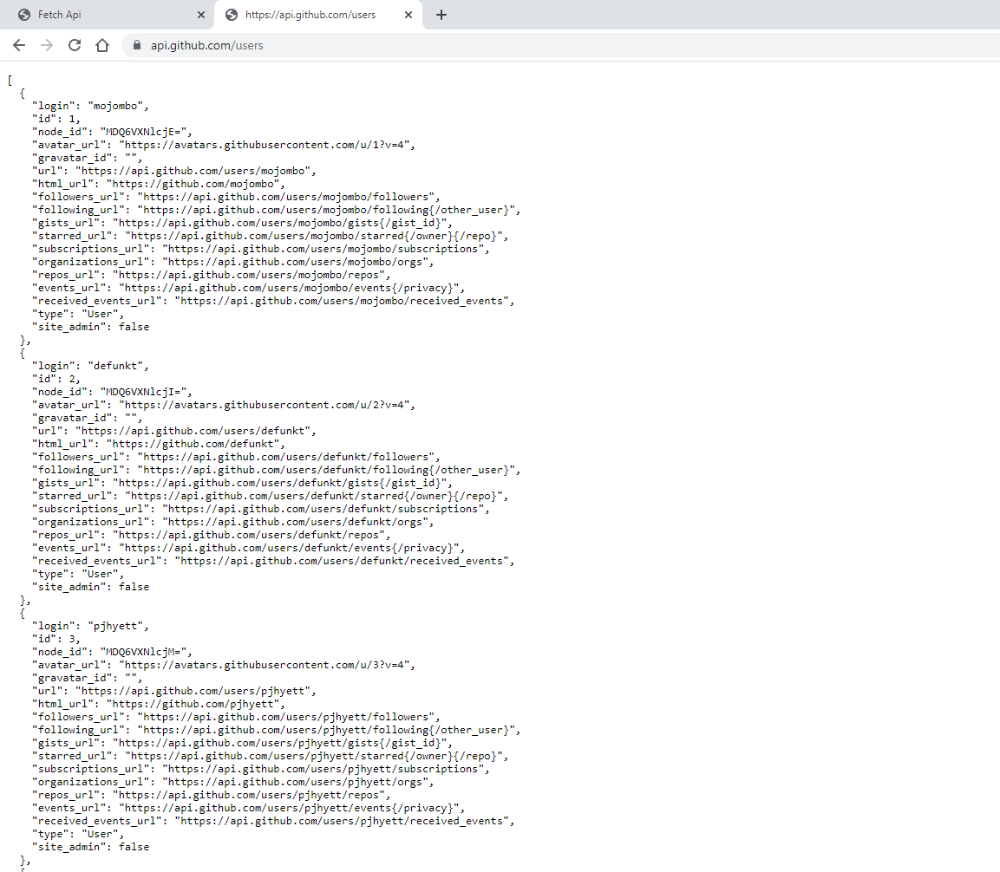

# The features of javascript in this repository;
- fetch Usage.
- then Usage.
- Text File (.text()) Usage.
- Json File (.json()) Usage.
- Github Api (.json()) Usage.
A simple explanation has been tried.
-------------

